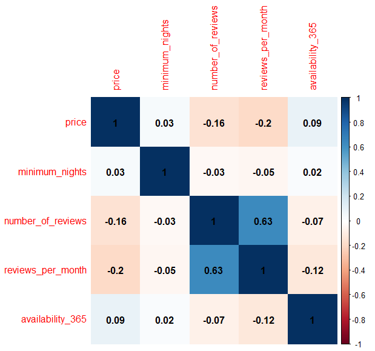

# cognitivo.ai
Teste de Análise de Dados Airbnb_Miguel Lellis

# cognitivo.ai
Teste de Análise de Dados Airbnb_Miguel Lellis

Relatório de análise baseado em um conjunto de dados provenientes do Airbnb.

Em dado projeto busca-se apresentar um modelo de predição de custos mediante regressão linear, utilizando o software R como forma de apoio.

Primeiramente é realizado a importação e observação dos dados.

Identificando as seguintes variáveis no dataset. Vale ressaltar que também foi possível identificar a falta de dados em algumas variávies, 
como por exemplo na variável "neighbourhood_group", indicando ausência total de dados e em "reviews_per_month" indicando falta de 37,415% dos dados.

| Variável                        |Percent. nulo |
|---------------------------------|--------------|
|id                               |      0.00000 |
|name                             |     0.00000  |
|host_id                          |      0.00000 |
|host_name                        |      0.00000 |
|neighbourhood_group              |    100.00000 |
|neighbourhood                    |      0.00000 |
|latitude                         |      0.00000 |
|longitude                        |      0.00000 |
|room_type                        |      0.00000 |
|price                            |      0.00000 |
|minimum_nights                   |      0.00000 |
|number_of_reviews                |      0.00000 |
|last_review                      |      0.00000 |
|reviews_per_month                |     37.41499 |
|calculated_host_listings_count   |      0.00000 |
|availability_365                 |      0.00000 |

Desta forma, realizou-se primeiramente uma exploração dos dados. Mediante histogramas, possibilitou-se
observar o comportamento dos registros em quatro variáveis, sendo estas consideradas principais para o modelo
de avaliação, são elas: prince. minimum_nights, number_of_reviwes e availability_365.

Realizando uma melhor exploração da variável price, principal variável para dada análise de predição, observou-se
alguns outliers, ou pontos fora da curva, nos dados, conforme na imagem abaixo.

Desta forma, considerou-se imóveis com preços de até R$2000,00, cercar de 95,64% dos dados originais, resultando nos gráficos abaixo.

Mediante o novo conjunto de dados, obteve-se:

- Média das diárias no Rio de Janeiro: R$404,31

- Procentagem dos tipos de imóveis mais presentes:

|Tipo de imóvel  |Percent|
|----------------|------|
|Entire home/apt |0.715 |
|      Hotel room|0.003 |
|    Private room|0.256 |
|     Shared room|0.023 |

- Os 10 bairros mais presentes:

| Bairros                  |Número de imóveis|
|--------------------------|-----|
|                Copacabana| 7509|
|           Barra da Tijuca| 2493|
|                   Ipanema| 2453|
|               Jacarepaguá| 1284|
|                  Botafogo| 1203|
|  Recreio dos Bandeirantes| 1112|
|                    Leblon| 1085|
|              Santa Teresa|  846|
|                    Centro|  762|
|                  Flamengo|  597|

Dada uma breve exploração dos dados, realizou-se o tratamento do modelo para predição.

Inicialmente, realizando uma correlação de Pearson entre as variáveis numéricas, ou seja:
-price;
-minimum_nights ;
-number_of_reviews;
-reviews_per_month;
-availability_365

Observa-se que as variáveis number_of_reviews e reviews_per_month estão bem relacionadas, com cerca de 63% de correlação.
As demais variáveis não apresentaram valores suficientemente fortes para indicarem uma correlação entre seus dados.

Seguindo para o modelo de regressão linear, resultando nos seguintes coeficientes de impacto.

| Coefficients:                          |            |                  |                     |
|----------------------------------------|------------|------------------|---------------------|
| Estimate Std. Error t value Pr(>\|t\|) |            |                  |                     |
| (Intercept)                            | 72.76305   | 354.26209        | 0.205 0.837267      |
| neighbourhoodAbolição                | 295.59370  | 388.04451        | 0.762 0.446215      |
| neighbourhoodAcari                     | 77.29585   | 500.93541        | 0.154 0.877372      |
| neighbourhoodAlto da Boa Vista         | 584.85368  | 359.89590        | 1.625 0.104161      |
| neighbourhoodAnchieta                  | 968.09263  | 501.18522        | 1.932 0.053419 .    |
| neighbourhoodAndaraí                  | 342.31568  | 358.06849        | 0.956 0.339078      |
| neighbourhoodAnil                      | 339.12598  | 358.63824        | 0.946 0.344365      |
| neighbourhoodBancários                | 56.52275   | 409.01597        | 0.138 0.890090      |
| neighbourhoodBangu                     | 351.16021  | 363.94454        | 0.965 0.334618      |
| neighbourhoodBarra da Tijuca           | 441.21688  | 354.29559        | 1.245 0.213020      |
| neighbourhoodBarra de Guaratiba        | 368.42642  | 357.43271        | 1.031 0.302664      |
| neighbourhoodBarros Filho              | 210.02771  | 396.04871        | 0.530 0.595903      |
| neighbourhoodBenfica                   | 357.82917  | 373.37915        | 0.958 0.337894      |
| neighbourhoodBento Ribeiro             | 101.43563  | 375.71426        | 0.270 0.787177      |
| neighbourhoodBonsucesso                | 123.99734  | 362.19782        | 0.342 0.732093      |
| neighbourhoodBotafogo                  | 267.87877  | 354.37541        | 0.756 0.449705      |
| neighbourhoodBrás de Pina             | 155.19286  | 361.55453        | 0.429 0.667754      |
| neighbourhoodCachambi                  | 194.23900  | 360.49573        | 0.539 0.590022      |
| neighbourhoodCacuia                    | 780.28303  | 433.84102        | 1.799 0.072102 .    |
| neighbourhoodCamorim                   | 262.92613  | 354.93900        | 0.741 0.458843      |
| neighbourhoodCampinho                  | 337.10853  | 371.52077        | 0.907 0.364217      |
| neighbourhoodCampo Grande              | 228.83932  | 356.43039        | 0.642 0.520859      |
| neighbourhoodCascadura                 | 179.47919  | 382.61647        | 0.469 0.639014      |
| neighbourhoodCatete                    | 221.30340  | 354.97557        | 0.623 0.533006      |
| neighbourhoodCatumbi                   | 303.55753  | 373.38928        | 0.813 0.416238      |
| neighbourhoodCavalcanti                | 909.23557  | 433.84167        | 2.096 0.036112 *    |
| neighbourhoodCentro                    | 166.54319  | 354.45854        | 0.470 0.638465      |
| neighbourhoodCidade de Deus            | 378.96053  | 368.69825        | 1.028 0.304038      |
| neighbourhoodCidade Nova               | 167.97049  | 362.97948        | 0.463 0.643544      |
| neighbourhoodCidade Universitária     | 25.52617   | 396.04198        | 0.064 0.948610      |
| neighbourhoodCocotá                   | 350.00128  | 382.63809        | 0.915 0.360355      |
| neighbourhoodCoelho Neto               | 60.20027   | 388.04311        | 0.155 0.876714      |
| neighbourhoodComplexo do Alemão       | 628.11898  | 433.90912        | 1.448 0.147746      |
| neighbourhoodCopacabana                | 274.72040  | 354.24842        | 0.776 0.438050      |
| neighbourhoodCordovil                  | 178.41094  | 433.85552        | 0.411 0.680913      |
| neighbourhoodCosme Velho               | 313.11998  | 356.49207        | 0.878 0.379770      |
| neighbourhoodCosmos                    | 408.45057  | 373.39439        | 1.094 0.274016      |
| neighbourhoodCuricica                  | 309.02725  | 357.37996        | 0.865 0.387210      |
| neighbourhoodDel Castilho              | 240.68045  | 367.59776        | 0.655 0.512642      |
| neighbourhoodDeodoro                   | 188.41293  | 433.84126        | 0.434 0.664082      |
| neighbourhoodEncantado                 | 234.35462  | 365.13630        | 0.642 0.520991      |
| neighbourhoodEngenho da Rainha         | 566.88122  | 396.02927        | 1.431 0.152324      |
| neighbourhoodEngenho de Dentro         | 411.77768  | 358.33293        | 1.149 0.250506      |
| neighbourhoodEngenho Novo              | 324.54502  | 359.12575        | 0.904 0.366159      |
| neighbourhoodEstácio                  | 207.07756  | 356.76681        | 0.580 0.561631      |
| neighbourhoodFlamengo                  | 243.12580  | 354.52493        | 0.686 0.492859      |
| neighbourhoodFreguesia (Ilha)          | 667.80991  | 433.85232        | 1.539 0.123754      |
| neighbourhoodFreguesia (Jacarepaguá)  | 369.31900  | 355.52641        | 1.039 0.298910      |
| neighbourhoodGávea                    | 376.27739  | 355.24271        | 1.059 0.289513      |
| neighbourhoodGaleão                   | -4.72479   | 409.04281        | -0.012 0.990784     |
| neighbourhoodGamboa                    | 236.83861  | 365.86069        | 0.647 0.517414      |
| neighbourhoodGardênia Azul            | 443.66113  | 364.48785        | 1.217 0.223533      |
| neighbourhoodGericinó                 | 157.33225  | 500.96368        | 0.314 0.753479      |
| neighbourhoodGlória                   | 212.29290  | 355.09768        | 0.598 0.549950      |
| neighbourhoodGrajaú                   | 303.51263  | 357.90406        | 0.848 0.396430      |
| neighbourhoodGrumari                   | 412.12026  | 409.02452        | 1.008 0.313671      |
| neighbourhoodGuadalupe                 | 179.10000  | 369.98096        | 0.484 0.628334      |
| neighbourhoodGuaratiba                 | 398.88743  | 356.67472        | 1.118 0.263428      |
| neighbourhoodHigienópolis             | 281.40365  | 371.53233        | 0.757 0.448809      |
| neighbourhoodHonório Gurgel           | -3.16958   | 500.96866        | -0.006 0.994952     |
| neighbourhoodHumaitá                  | 329.47037  | 355.31291        | 0.927 0.353796      |
| neighbourhoodInhaúma                  | 272.91102  | 382.61406        | 0.713 0.475679      |
| neighbourhoodInhoaíba                 | 464.87879  | 396.03282        | 1.174 0.240471      |
| neighbourhoodIpanema                   | 396.96914  | 354.29720        | 1.120 0.262536      |
| neighbourhoodIrajá                    | 304.36988  | 360.50796        | 0.844 0.398521      |
| neighbourhoodItanhangá                | 482.45395  | 355.79635        | 1.356 0.175117      |
| neighbourhoodJacaré                   | 384.41686  | 396.03522        | 0.971 0.331725      |
| neighbourhoodJacarepaguá              | 411.08708  | 354.36275        | 1.160 0.246030      |
| neighbourhoodJardim Botânico          | 375.81476  | 355.15732        | 1.058 0.289991      |
| neighbourhoodJardim Carioca            | 177.19590  | 388.09098        | 0.457 0.647974      |
| neighbourhoodJardim Guanabara          | 206.25418  | 357.56916        | 0.577 0.564064      |
| neighbourhoodJardim Sulacap            | 460.00939  | 373.39694        | 1.232 0.217976      |
| neighbourhoodJoá                      | 693.31785  | 358.98059        | 1.931 0.053451 .    |
| neighbourhoodLagoa                     | 495.34975  | 354.98549        | 1.395 0.162905      |
| neighbourhoodLaranjeiras               | 296.12938  | 354.65516        | 0.835 0.403738      |
| neighbourhoodLeblon                    | 439.51049  | 354.38821        | 1.240 0.214915      |
| neighbourhoodLeme                      | 291.09037  | 354.58235        | 0.821 0.411689      |
| neighbourhoodLins de Vasconcelos       | 183.22077  | 366.67080        | 0.500 0.617300      |
| neighbourhoodMéier                    | 301.27110  | 360.73806        | 0.835 0.403640      |
| neighbourhoodMadureira                 | 32.67083   | 382.59762        | 0.085 0.931950      |
| neighbourhoodMagalhães Bastos         | 2.81314    | 500.93834        | 0.006 0.995519      |
| neighbourhoodMangueira                 | 248.95228  | 382.73201        | 0.650 0.515400      |
| neighbourhoodManguinhos                | 442.06528  | 433.83089        | 1.019 0.308222      |
| neighbourhoodMaré                     | 251.15036  | 500.97365        | 0.501 0.616147      |
| neighbourhoodMaracanã                 | 482.16229  | 355.34444        | 1.357 0.174829      |
| neighbourhoodMarechal Hermes           | 208.63657  | 373.42405        | 0.559 0.576363      |
| neighbourhoodMaria da Graça           | 314.11251  | 367.60162        | 0.854 0.392841      |
| neighbourhoodMoneró                   | 158.16665  | 409.03878        | 0.387 0.698997      |
| neighbourhoodOlaria                    | 329.59073  | 375.72495        | 0.877 0.380379      |
| neighbourhoodOsvaldo Cruz              | 945.08825  | 396.04828        | 2.386 0.017026 *    |
| neighbourhoodPaciência                | 400.49238  | 375.70612        | 1.066 0.286446      |
| neighbourhoodPadre Miguel              | 183.10363  | 371.53283        | 0.493 0.622135      |
| neighbourhoodPaquetá                  | 290.37637  | 359.40062        | 0.808 0.419129      |
| neighbourhoodParada de Lucas           | 89.89016   | 378.67710        | 0.237 0.812364      |
| neighbourhoodParque Anchieta           | 497.64472  | 388.08465        | 1.282 0.199746      |
| neighbourhoodPavuna                    | 487.83629  | 396.05063        | 1.232 0.218053      |
| neighbourhoodPechincha                 | 412.36663  | 357.75625        | 1.153 0.249066      |
| neighbourhoodPedra de Guaratiba        | 295.08874  | 373.38216        | 0.790 0.429352      |
| neighbourhoodPenha                     | 224.17917  | 364.50726        | 0.615 0.538547      |
| neighbourhoodPenha Circular            | 100.13910  | 373.40234        | 0.268 0.788563      |
| neighbourhoodPiedade                   | 307.06284  | 368.69655        | 0.833 0.404946      |
| neighbourhoodPilares                   | 240.42044  | 375.73707        | 0.640 0.522267      |
| neighbourhoodPitangueiras              | 44.45340   | 382.60076        | 0.116 0.907505      |
| neighbourhoodPortuguesa                | 203.75729  | 362.58504        | 0.562 0.574150      |
| neighbourhoodPraça da Bandeira        | 328.11800  | 357.69242        | 0.917 0.358984      |
| neighbourhoodPraça Seca               | 311.62000  | 362.20145        | 0.860 0.389604      |
| neighbourhoodPraia da Bandeira         | 354.40329  | 396.04535        | 0.895 0.370873      |
| neighbourhoodQuintino Bocaiúva        | 411.22871  | 378.70724        | 1.086 0.277545      |
| neighbourhoodRamos                     | 204.87965  | 373.41343        | 0.549 0.583239      |
| neighbourhoodRealengo                  | 692.34074  | 375.74424        | 1.843 0.065401 .    |
| neighbourhoodRecreio dos Bandeirantes  | 415.89557  | 354.38467        | 1.174 0.240578      |
| neighbourhoodRiachuelo                 | 359.23081  | 364.50203        | 0.986 0.324369      |
| neighbourhoodRibeira                   | 345.81554  | 409.02703        | 0.845 0.397863      |
| neighbourhoodRicardo de Albuquerque    | 550.16515  | 375.70686        | 1.464 0.143112      |
| neighbourhoodRio Comprido              | 337.20504  | 356.17470        | 0.947 0.343780      |
| neighbourhoodRocha                     | 307.17035  | 362.97903        | 0.846 0.397422      |
| neighbourhoodRocha Miranda             | 419.38772  | 409.03883        | 1.025 0.305231      |
| neighbourhoodRocinha                   | 185.02274  | 362.98089        | 0.510 0.610244      |
| neighbourhoodSão Conrado              | 500.68542  | 355.20682        | 1.410 0.158682      |
| neighbourhoodSão Cristóvão          | 278.46366  | 356.52266        | 0.781 0.434778      |
| neighbourhoodSão Francisco Xavier     | 512.88480  | 362.19209        | 1.416 0.156771      |
| neighbourhoodSaúde                    | 179.01858  | 361.54030        | 0.495 0.620495      |
| neighbourhoodSampaio                   | 308.47716  | 373.39829        | 0.826 0.408736      |
| neighbourhoodSanta Cruz                | 365.64051  | 363.94537        | 1.005 0.315071      |
| neighbourhoodSanta Teresa              | 258.32112  | 354.44191        | 0.729 0.466124      |
| neighbourhoodSantíssimo               | 252.33190  | 373.40488        | 0.676 0.499200      |
| neighbourhoodSanto Cristo              | 347.68967  | 371.52998        | 0.936 0.349369      |
| neighbourhoodSenador Camará           | 271.94893  | 382.62270        | 0.711 0.477246      |
| neighbourhoodSenador Vasconcelos       | 190.90518  | 382.59863        | 0.499 0.617805      |
| neighbourhoodSepetiba                  | 429.86848  | 382.60666        | 1.124 0.261225      |
| neighbourhoodTanque                    | 273.40840  | 365.85017        | 0.747 0.454875      |
| neighbourhoodTaquara                   | 344.45833  | 355.78350        | 0.968 0.332970      |
| neighbourhoodTauá                     | 140.88708  | 373.39548        | 0.377 0.705944      |
| neighbourhoodTijuca                    | 330.60421  | 354.62148        | 0.932 0.351204      |
| neighbourhoodTodos os Santos           | 397.51219  | 360.29076        | 1.103 0.269903      |
| neighbourhoodTomás Coelho             | 171.61129  | 388.03480        | 0.442 0.658307      |
| neighbourhoodUrca                      | 323.83536  | 355.89600        | 0.910 0.362876      |
| neighbourhoodVargem Grande             | 433.77406  | 356.14652        | 1.218 0.223249      |
| neighbourhoodVargem Pequena            | 439.36196  | 355.86384        | 1.235 0.216978      |
| neighbourhoodVasco da Gama             | 202.20981  | 371.56945        | 0.544 0.586305      |
| neighbourhoodVaz Lobo                  | 763.86419  | 433.83119        | 1.761 0.078294 .    |
| neighbourhoodVicente de Carvalho       | 382.07020  | 382.62430        | 0.999 0.318021      |
| neighbourhoodVidigal                   | 233.61649  | 355.58771        | 0.657 0.511195      |
| neighbourhoodVigário Geral            | 42.28244   | 433.82969        | 0.097 0.922359      |
| neighbourhoodVila da Penha             | 234.81750  | 370.04119        | 0.635 0.525714      |
| neighbourhoodVila Isabel               | 356.49784  | 355.20962        | 1.004 0.315568      |
| neighbourhoodVila Kosmos               | 37.95425   | 501.14935        | 0.076 0.939631      |
| neighbourhoodVila Militar              | 204.06776  | 409.01688        | 0.499 0.617838      |
| neighbourhoodVila Valqueire            | 392.01179  | 365.13636        | 1.074 0.283011      |
| neighbourhoodVista Alegre              | 1373.33225 | 500.96368        | 2.741 0.006122 **   |
| neighbourhoodZumbi                     | 86.42388   | 500.96862        | 0.173 0.863035      |
| room_typeHotel room                    | -223.63912 | 36.08596         | -6.197 5.83e-10 *** |
| room_typePrivate room                  | -226.11264 | 5.34563 -42.299  | < 2e-16 ***         |
| room_typeShared room                   | -268.11631 | 15.06482 -17.798 | < 2e-16 ***         |
| minimum_nights                         | 0.40654    | 0.11581          | 3.510 0.000448 ***  |
| availability_365                       | 0.28934    | 0.01586          | 18.243              |

Pelo modelo apresentado, observou-se que as varáveis neighbourhood e room_type, apresentaram os maiores impactos na análise.

Para teste das relações e capacidade do modelo, utilizou-se das médias de cada relação, com a previsão gerada pelo modelo.

Como por exemplo:

Média de Entire home/apt em Copacabana = 397.5408
Predição do modelo para o mesmo caso= 455.1269 

Média de Entire Private room em Copacabana = 237.0886
Predição do modelo para o mesmo caso= 229.0143 

Média de Entire home/apt em Barra da Tijuca = 598.9303
Predição do modelo para o mesmo caso= 620.8103 

Média de Entire home/apt em Ipanema = 538.343
Predição do modelo para o mesmo caso= 576.5626

Mesmo baseado em uma avaliação simples e exploratória dos dados brutos, entende-se que o modelo pode dar suporte para decisões com médio grau de impacto.
Desta forma entende-se que para uma melhor precisão em dada análise, faz-se necessário explorar outros modelos, test=a-los e validálos em diferentes conjuntos de dados.

Abaixo , seguem as perguntas e respostas solicitadas:

a. Como foi a definição da sua estratégia de modelagem?

Busquei por previamente explorar e entender os dados com os quais estava trabalhando para depois, baseados em comportamentos dos dados.
Após o tratamento e remoção de outliers, trabalhei em um modelo simples e de fácil entendimento para predição de custos.

b. Como foi definida a função de custo utilizada?
A função foi determinada com base nos dados explorados e baseado na área de concentração dos valores, busquei restringir minha amostra 
e trabalhar com um conjunto menos, entretanto sem muitos casos especiais.

c. Qual foi o critério utilizado na seleção do modelo final?
Baseado em pesquisas, vi que mesmo o modelo de refressão linear sendo simples, proporciona avaliações relativamente eficazes, 
desta forma busquei trabalhar cm um modelo que fosse simples e de fácil exploração.

d. Qual foi o critério utilizado para validação do modelo?
Por que escolheu utilizar este método?

Para validar o modelo, utilizei das médias dos custos de locações em condições específicas,
comparado-as com as predições apresentadas pelo meu modelo.

É reconhecido que o modelo não apresenta a maior robustez, mas viabiliza análises simples e de baixo grau de impacto.

e. Quais evidências você possui de que seu modelo é suficientemente bom?

O modelo se adaptou bem ao conjunto de dados explorado e apresentou resultados satisfatórios quanto as médias dos custos de locações.

Conforme o projeto explorado, possibilitou-se uma análise simples, porém efetiva quando ao conjunto de dados proveniente do Airbnb.
Baseado em um modelo de regressão linear, possibilitou-se prever alguns possíveis custos de locações em condições específicas no Rio de Janeiro.
