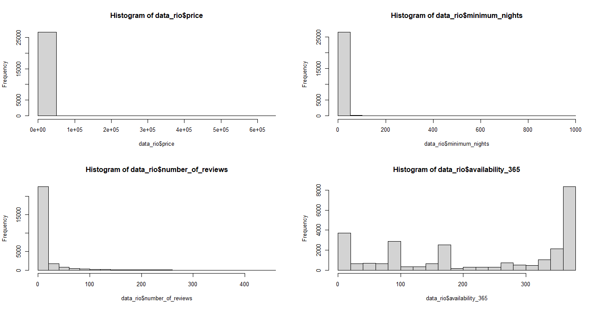
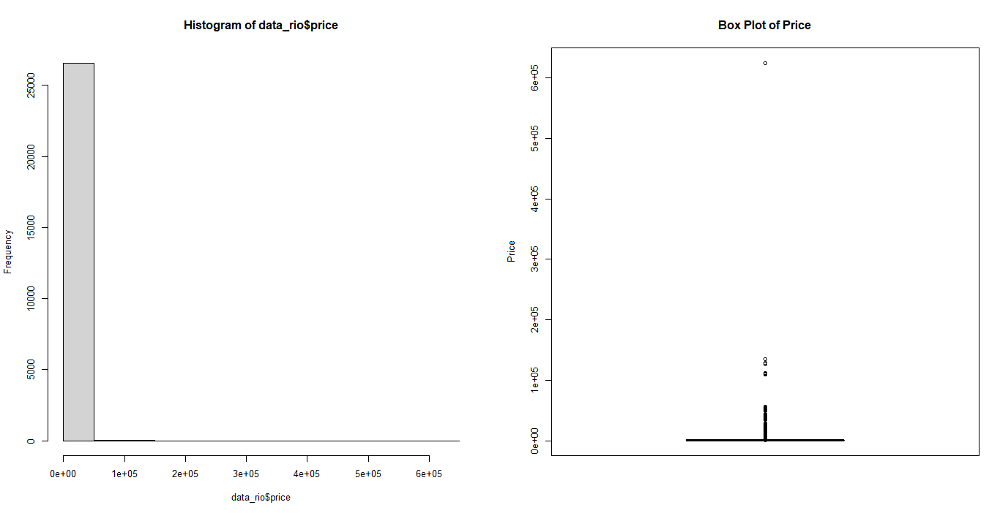
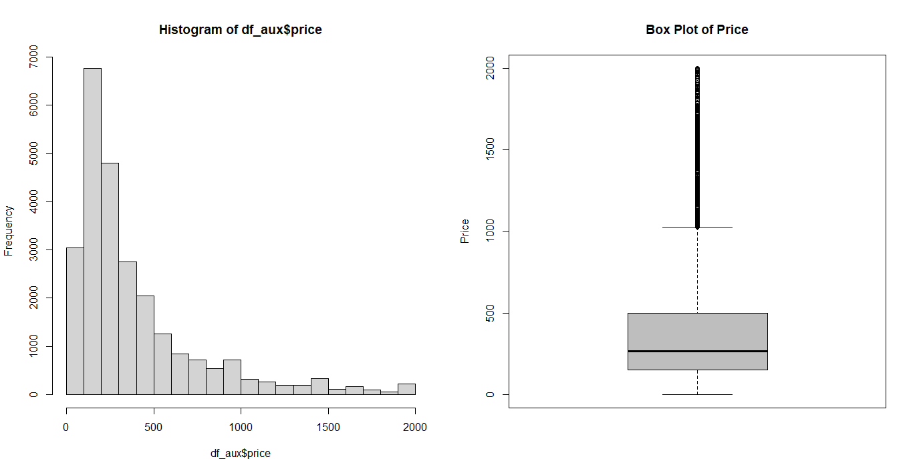

# cognitivo.ai
Teste de Análise de Dados Airbnb_Miguel Lellis

# cognitivo.ai
Teste de Análise de Dados Airbnb_Miguel Lellis

Relatório de análise baseado em um conjunto de dados provenientes do Airbnb.

Em dado projeto busca-se apresentar um modelo de predição de custos mediante regressão linear, utilizando o software R como forma de apoio.

Primeiramente é realizado a importação e observação dos dados.

Identificando as seguintes variáveis no dataset. Vale ressaltar que também foi possível identificar a falta de dados em algumas variávies, 
como por exemplo na variável "neighbourhood_group", indicando ausência total de dados e em "reviews_per_month" indicando falta de 37,415% dos dados.

| Variável                        |Percent. nulo |
|---------------------------------|--------------|
|id                               |      0.00000 |
|name                             |     0.00000  |
|host_id                          |      0.00000 |
|host_name                        |      0.00000 |
|neighbourhood_group              |    100.00000 |
|neighbourhood                    |      0.00000 |
|latitude                         |      0.00000 |
|longitude                        |      0.00000 |
|room_type                        |      0.00000 |
|price                            |      0.00000 |
|minimum_nights                   |      0.00000 |
|number_of_reviews                |      0.00000 |
|last_review                      |      0.00000 |
|reviews_per_month                |     37.41499 |
|calculated_host_listings_count   |      0.00000 |
|availability_365                 |      0.00000 |

Desta forma, realizou-se primeiramente uma exploração dos dados. Mediante histogramas, possibilitou-se
observar o comportamento dos registros em quatro variáveis, sendo estas consideradas principais para o modelo
de avaliação, são elas: prince. minimum_nights, number_of_reviwes e availability_365.

Realizando uma melhor exploração da variável price, principal variável para dada análise de predição, observou-se
alguns outliers, ou pontos fora da curva, nos dados, conforme na imagem abaixo.

Desta forma, considerou-se imóveis com preços de até R$2000,00, cercar de 95,64% dos dados originais, resultando nos gráficos abaixo.

Mediante o novo conjunto de dados, obteve-se:

Média das diárias no Rio de Janeiro: R$404,31

Procentagem dos tipos de imóveis mais presentes:
|Tipo de imóvel  |Percent|
|----------------|------|
|Entire home/apt |0.715 |
|      Hotel room|0.003 |
|    Private room|0.256 |
|     Shared room|0.023 |

